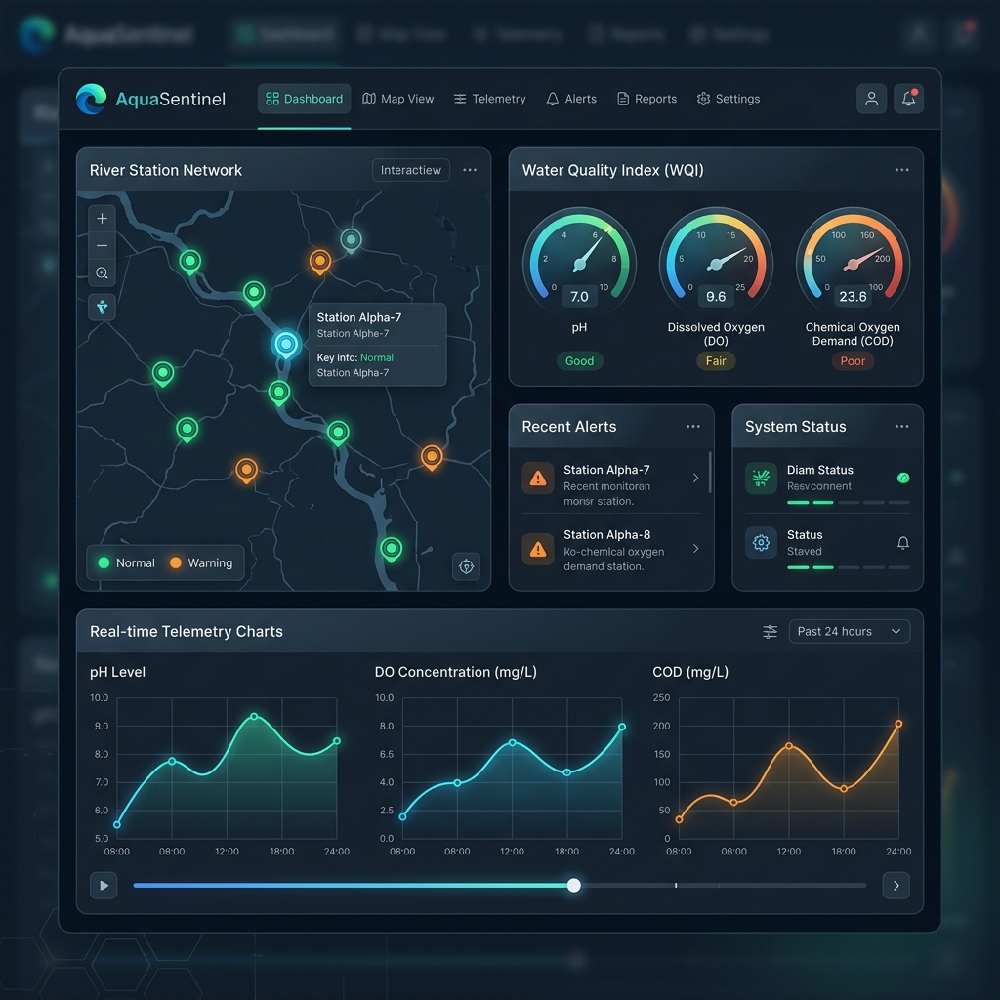
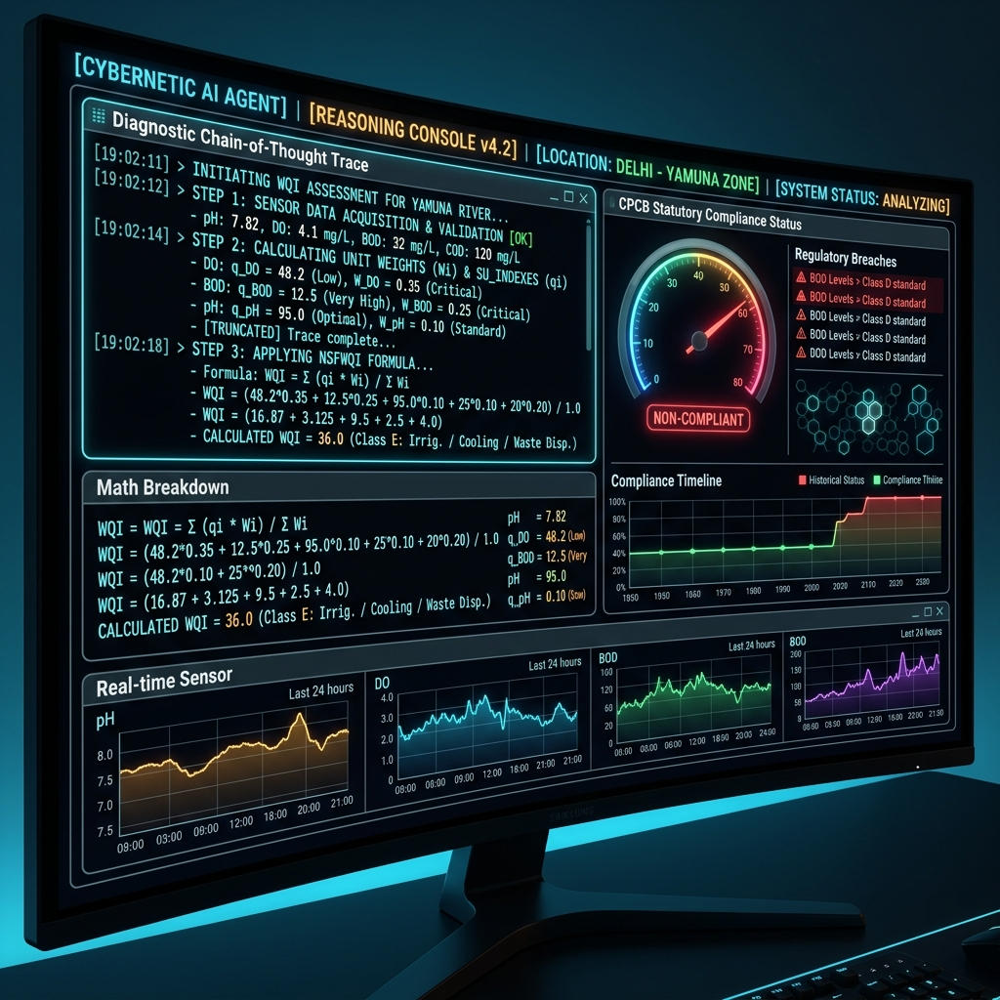

# AquaSentinel: The Ultimate Beginner-Friendly & Advanced Technical Guide (`HOW_AND_WHAT.md`)

Welcome to the complete, beginner-friendly master guide for **AquaSentinel**! 

Whether you are a beginner with no coding or science background, a student, or a senior developer, this guide explains **EVERY SINGLE DETAIL** of how this website works — internally (behind the scenes in code and math) and externally (what you see on the screen).

---

## 📸 Visual Screenshots Reference

### 1. Main AquaSentinel Dashboard Interface

*The main screen of AquaSentinel. It shows the river map, live water health meters, telemetry charts, and station cards.*

### 2. Autonomous AI Agent Reasoning Console

*The AI Brain Terminal. It shows the AI thinking step-by-step (Chain-of-Thought), checking water safety laws, and issuing emergency directives.*

---

## 🌟 PART 1: The Big Picture (Explain Like I'm 5)

### What is AquaSentinel?
Imagine the **Periyar River** (a massive 88 km long river in Kerala, India) is a living patient in a hospital. 

Usually, rivers get polluted quietly — factories dump dirty chemicals, cities release sewage, or heavy rains wash mud into the water. By the time people notice dead fish floating or smelly drinking water, it's already too late.

**AquaSentinel** acts like an **AI Doctor and 24/7 Security Guard for the River**:
1. It places 5 digital "monitoring stations" along the river from start to finish.
2. Every 5 seconds, it measures 7 "vital signs" of the water (like oxygen, acidity, and muddy sediment).
3. An **Autonomous AI Agent** analyzes those numbers instantly.
4. If a factory dumps toxic waste, the AI catches it in seconds, predicts where the toxic blob will float down the river, and tells authorities to shut off drinking water intakes before anyone gets sick!

---

## 🧪 PART 2: Understanding the 7 Water "Vital Signs" (Telemetry)

Just like a human doctor checks your temperature, blood pressure, and pulse, AquaSentinel checks 7 water indicators:

| Vital Sign (Parameter) | What It Measures in Simple Words | Ideal Healthy Level | What Happens If It's Bad? |
| :--- | :--- | :--- | :--- |
| **pH** | How acidic or alkaline the water is (like lemon juice vs. soap water). | **6.5 to 8.5** | If too low (< 5.0), acid burns fish skin. If too high (> 9.0), it burns aquatic plants. |
| **Dissolved Oxygen (DO)** | How much oxygen gas is dissolved in the water for fish to breathe. | **> 6.0 mg/L** | If DO drops below **2.0 mg/L**, fish suffocate and die (called a fish kill event). |
| **Turbidity** | How cloudy or muddy the water looks (measured in NTU). | **< 5.0 NTU** | High turbidity blocks sunlight, preventing underwater plants from growing. |
| **BOD** (Biochemical Oxygen Demand) | How much organic waste (like sewage or food scraps) is in the water. | **< 2.0 mg/L** | Bacteria eat organic waste and consume all the river's oxygen in the process. |
| **COD** (Chemical Oxygen Demand) | How much toxic industrial chemical waste is in the water. | **< 15.0 mg/L** | Spikes in COD indicate illegal chemical factory dumps (like acids or heavy metals). |
| **Temperature** | Water heat in Celsius (°C). | **24°C to 28°C** | Warm water cannot hold as much oxygen as cold water. Hot factory discharges choke fish. |
| **EC** (Electrical Conductivity) | How many dissolved salts, minerals, or industrial ions are in the water. | **< 300 µS/cm** | Extreme EC means salty ocean water intrusion or heavy mineral pollution. |

---

## 🗺️ PART 3: The 5 River Monitoring Stations

AquaSentinel tracks 5 specific stations along the 88 km Periyar River:

```
[Bhoothathankettu Dam] ──▶ [Neriamangalam Bridge] ──▶ [Aluva Water Intake] ──▶ [Eloor Industrial Belt] ──▶ [Cochin Estuary]
   (km 0.0 - Clean)           (km 24.5 - Farms)        (km 62.0 - Drinking)        (km 74.5 - Factories)       (km 88.0 - Ocean)
```

1. **Station 1: Bhoothathankettu Dam (`NODE_BHT_01` - km 0.0)**
   * **Location**: Clean mountain reservoir at the start of the river.
   * **Role**: Benchmark control station (fresh, pristine water).
2. **Station 2: Neriamangalam Bridge (`NODE_NRM_02` - km 24.5)**
   * **Location**: Agricultural region.
   * **Role**: Monitors pesticide runoff and soil erosion during rains.
3. **Station 3: Aluva Water Intake (`NODE_ALV_03` - km 62.0)**
   * **Location**: Municipal drinking water pumping station for millions of citizens.
   * **Role**: **MOST CRITICAL PUBLIC HEALTH POINT**. Must remain clean (CPCB Class A/C).
4. **Station 4: Eloor Industrial Belt (`NODE_ELR_04` - km 74.5)**
   * **Location**: Home to over 250 chemical factories, insecticide plants, and fertilizer units.
   * **Role**: Highest threat zone for chemical spills and acid leaks.
5. **Station 5: Cochin Estuary (`NODE_KCH_05` - km 88.0)**
   * **Location**: Where the river meets the salty Arabian Sea.
   * **Role**: Estuarine tidal mixing zone.

---

## 🤖 PART 4: How the AI Brain Works (Deep Algorithmic Explanation)

The AI Agent inside `backend/core/ai_agent.py` does not just guess; it uses mathematical formulas, statutory water laws, and physics. Here is how it thinks:

---

### Algorithm 1: The Water Quality Index (WQI) — *The Overall Report Card*
The AI calculates a single grade from **0 to 100** for each station:

$$WQI = (q_{\text{pH}} \times 0.15) + (q_{\text{DO}} \times 0.25) + (q_{\text{turb}} \times 0.15) + (q_{\text{BOD}} \times 0.20) + (q_{\text{COD}} \times 0.15) + (q_{\text{EC}} \times 0.10)$$

* **Plain English Meaning**: Each parameter gets a score $q_i$ from 0 to 100. Oxygen ($DO$) and sewage ($BOD$) have the biggest weights (25% and 20%) because they directly affect aquatic life.
* **Score Meaning**:
  * **90 – 100**: Excellent / Pristine Water 🟢
  * **70 – 89**: Good / Minor Stress 🟡
  * **50 – 69**: Poor / Contaminated 🟠
  * **0 – 49**: Critical / Hazardous Waste 🔴

---

### Algorithm 2: The Nemerow Pollution Index (PI) — *The Smoke Detector*
A major flaw with standard averages is that if 6 parameters are perfect, but **COD (chemical waste)** is 10 times over the limit, the average might still look "okay". 

The **Nemerow Index** solves this by specifically punishing single extreme spikes:

$$PI = \sqrt{\frac{R_{\text{max}}^2 + R_{\text{avg}}^2}{2}}$$

* **Plain English Meaning**: $R_{\text{max}}$ is the worst parameter ratio. If even *one* chemical parameter explodes, $PI$ jumps above **2.5**, instantly triggering a **CRITICAL ALERT** regardless of the average!

---

### Algorithm 3: CPCB Statutory Water Classification — *The Legal Compliance Engine*
The AI compares the calculated numbers against India's **Central Pollution Control Board (CPCB)** legal standards:

* 🥇 **Class A**: $WQI \ge 88$, $\text{DO} \ge 6.0$, $\text{BOD} \le 2.0$ $\rightarrow$ *Safe to drink directly without treatment*.
* 🥈 **Class B**: $WQI \ge 75$, $\text{DO} \ge 5.0$, $\text{BOD} \le 3.0$ $\rightarrow$ *Safe for swimming & bathing*.
* 🥉 **Class C**: $WQI \ge 60$, $\text{DO} \ge 4.0$, $\text{BOD} \le 3.0$ $\rightarrow$ *Safe for drinking AFTER municipal treatment & chlorination*.
* ⚠️ **Class D**: $WQI \ge 45$, $\text{DO} \ge 4.0$ $\rightarrow$ *Only safe for fish & wildlife*.
* 🚫 **Class E**: $WQI \ge 30$ $\rightarrow$ *Only safe for industrial cooling & irrigation*.
* ☠️ **BELOW E**: $WQI < 30$ or $PI \ge 2.5$ $\rightarrow$ *Toxic Hazard — Unsuitable for human or animal contact*.

---

### Algorithm 4: Thermodynamic Sensor Validation — *The Lies Detector*
What if a sensor breaks and sends a fake reading? The AI performs physical sanity checks:

1. **Temperature vs Oxygen Check**: Cold water holds more oxygen than warm water. The max oxygen water can physically hold at temperature $T$ is:
   $$\text{DO}_{\text{max}} = 14.6 - (0.2 \times T)$$
   If a sensor reports $\text{DO} = 15.0\text{ mg/L}$ at $30^\circ\text{C}$, the AI knows the sensor is faulty and drops its confidence score!
2. **BOD vs COD Check**: Chemical Oxygen Demand ($COD$) must always be equal to or greater than Biological Oxygen Demand ($BOD$). If a sensor reports $BOD > COD$, the AI flags sensor noise.

---

### Algorithm 5: 30-Minute Future Trajectory Forecast ($d/dt$)
The AI looks at the previous readings to calculate the speed of change ($\Delta WQI$):

$$WQI_{\text{30-min forecast}} = WQI_{\text{current}} + (3.5 \times \Delta WQI)$$

* If the water quality is dropping fast ($\Delta WQI < -2.0$), the AI marks the trajectory as **`DETERIORATING`** and prepares early warnings *before* the disaster happens!

---

### Algorithm 6: Hydrodynamic Plume Tracking — *Tracking the Toxic Blob*
The Periyar River flows at an average speed of **1.4 km/h**. If an industrial leak occurs at Eloor (km 74.5), how long until it reaches the Ocean Estuary at km 88.0?

$$\text{Distance } \Delta d = 88.0 - 74.5 = 13.5 \text{ km}$$
$$\text{Arrival Time } T = \frac{13.5 \text{ km}}{1.4 \text{ km/h}} \approx 9.6 \text{ hours}$$

The AI immediately displays: *"Plume threat HIGH. Estimated arrival at Cochin Estuary in 9.6 hours."*

---

### Algorithm 7: Chain-of-Thought (CoT) Reasoning Engine
Instead of giving a mysterious score, the AI outputs its full 5-step thought process in the terminal:

1. **Step 1**: Ingest sensor frame & verify sensor confidence.
2. **Step 2**: Calculate WQI & check CPCB statutory grade.
3. **Step 3**: Identify root cause (e.g., *"Industrial Acid Discharge"*).
4. **Step 4**: Calculate downstream arrival time at nearby water intakes.
5. **Step 5**: Recommend immediate directive (e.g., *"Deploy Aeration Barges & Shut Intake Valves"*).

---

## 💻 PART 5: Full Software Architecture (How the Website is Built)

AquaSentinel is built using modern web development tools:

```
┌────────────────────────────────────────────────────────────────────────┐
│                          FRONTEND (Vercel)                             │
│                                                                        │
│   React 18 + TypeScript + Vite + Tailwind CSS + Framer Motion         │
│   - Renders interactive river maps and dark mode UI controls           │
│   - Fetches live data every 5 seconds from the Flask API               │
└───────────────────────────────────┬────────────────────────────────────┘
                                    │ HTTP REST API Requests
                                    ▼
┌────────────────────────────────────────────────────────────────────────┐
│                          BACKEND (Render)                              │
│                                                                        │
│   Python 3 + Flask + Gunicorn + NumPy + Pandas                         │
│   - Runs the Periyar River Simulation Engine                           │
│   - Executes the AquaSentinel AI Agent reasoning math                  │
│   - Exposes REST API endpoints on port 5000                            │
└────────────────────────────────────────────────────────────────────────┘
```

### Folder & File Breakdown

* 📂 **`backend/`**
  * [app.py](file:///c:/My_Project/AquaSentinel/backend/app.py): The main entry point for the Flask backend server.
  * [requirements.txt](file:///c:/My_Project/AquaSentinel/backend/requirements.txt): List of Python libraries (`flask`, `gunicorn`, `pandas`, `numpy`).
  * [Procfile](file:///c:/My_Project/AquaSentinel/backend/Procfile): Tells Render cloud how to start the server using `gunicorn`.
  * 📂 **`backend/core/`**
    * [ai_agent.py](file:///c:/My_Project/AquaSentinel/backend/core/ai_agent.py): The AI brain containing all WQI, Nemerow, CPCB, and CoT math.
    * [environment.py](file:///c:/My_Project/AquaSentinel/backend/core/environment.py): The simulation engine that simulates water flow and chemical spills.
  * 📂 **`backend/api/`**
    * [routes.py](file:///c:/My_Project/AquaSentinel/backend/api/routes.py): Defines URL routes like `/api/v1/telemetry/latest`.

* 📂 **`frontend/`**
  * [package.json](file:///c:/My_Project/AquaSentinel/frontend/package.json): Lists Node.js dependencies (React, Lucide icons, Framer Motion).
  * [vercel.json](file:///c:/My_Project/AquaSentinel/frontend/vercel.json): Configures Vercel single-page application (SPA) routing.
  * 📂 **`frontend/src/`**
    * 📂 **`components/river-map/`**: Interactive river map (`StationMap.tsx`, `NodeInfoPanel.tsx`).
    * 📂 **`components/dashboard/`**: Live AI terminal console (`AiConsole.tsx`) and emergency alerts (`AlertBroadcastModule.tsx`).
    * 📂 **`components/simulation/`**: Simulation mode controller buttons (`SimulationStudio.tsx`).
    * 📂 **`context/`**: `TelemetryContext.tsx` handles automatic background data fetching every 5 seconds.

---

## 🎛️ PART 6: The 6 Interactive Simulation Modes

AquaSentinel allows users to test real-world scenarios by switching simulation modes in the UI:

1. 🔄 **`HISTORICAL_REPLAY`**: Replays real historical water quality recordings along the Periyar river with organic micro-variations.
2. ☀️ **`NORMAL_CONDITIONS`**: Simulates a serene, healthy river with natural daily oxygen fluctuations.
3. 🏭 **`INDUSTRIAL_DISCHARGE`**: Simulates a toxic chemical spill at Eloor (`NODE_ELR_04`). COD shoots up to $170\text{ mg/L}$, pH drops to $3.8$, and the UI flashes **CRITICAL ALERT** 🔴.
4. 🌧️ **`HEAVY_RAINFALL`**: Simulates heavy monsoon storms, causing muddy sediment runoff ($>70\text{ NTU}$ turbidity).
5. 🎛️ **`MANUAL_TESTING`**: Lets you drag sliders in the UI to manually change pH, DO, or COD and watch the AI react live.
6. 🔬 **`DEVELOPER_MODE`**: Generates wild, chaotic test numbers to make sure the AI code doesn't crash on edge cases.

---

## ☁️ PART 7: Hosting & Cloud Setup

AquaSentinel is deployed across two free cloud services for maximum speed:

1. **Frontend on Vercel**:
   * Takes the React static code, builds it into `dist`, and serves it globally on Vercel's fast Edge network.
   * Uses environment variable `VITE_API_BASE_URL` to point to Render.
2. **Backend on Render**:
   * Runs the Python server inside a Linux container.
   * Powered by `gunicorn "app:create_app()"` so it can handle multiple simultaneous requests reliably.

---

### 💡 Summary Checklist

| Concept | Explanation |
| :--- | :--- |
| **Goal** | Stop river pollution before it reaches drinking water intakes. |
| **Inputs** | 7 water parameters across 5 Periyar River stations. |
| **AI Math** | WQI (overall health), Nemerow PI (single parameter spike detector), Thermodynamic validation, Plume timing. |
| **Output** | CPCB compliance grade, 30-min trajectory, 5-step Chain-of-Thought reasoning, and emergency alerts. |
| **Tech Stack** | React + Vite + TypeScript (Frontend) and Python + Flask + Gunicorn (Backend). |

---

*AquaSentinel — Protecting River Ecosystems through Autonomous Artificial Intelligence.*
